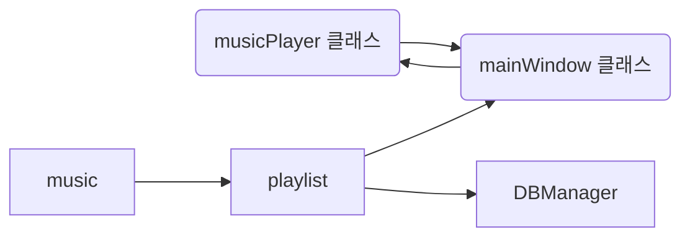

# ADS(Architecture Design Specification)

필요한 클래스?

- mainWindow

- musicPlayer (음악 재생, 음악 일시정지, 배속 드등 모든 기능 정의)
- DBManager
    - 음악 싹다 디비에 저장
    - 
- music 클래스
    

- playlist 클래스

- 

https://mdp.tylingsoft.com/